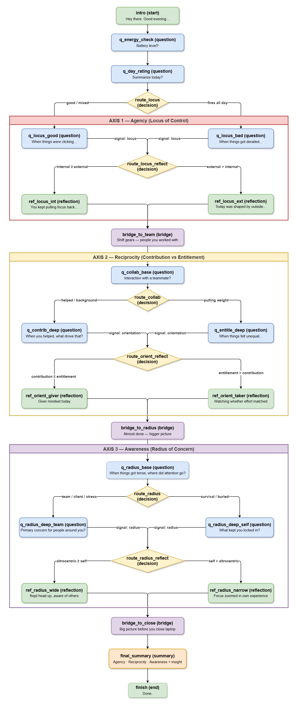

# The Daily Reflection Tree

**DeepThought Fellowship Assignment**

A deterministic, tree-based reflection tool designed to help employees process their workday across three psychological axes: **Agency** (Locus of Control), **Reciprocity** (Orientation), and **Awareness** (Radius of Concern). 

In accordance with the project constraints, **no LLMs are used at runtime**. The intelligence is encoded entirely into the JSON data structure and routed deterministically via Python.

---
# The Flow of Reflection Tree


## 📂 Repository Structure

```text
/
├── tree/
│   ├── reflection-tree.json     # Part A: The core knowledge graph and logic routing
│   └── tree-diagram.md          # Part A: Visual map of the logic flow (Mermaid)
├── agent/
│   ├── index.html               # Part B (Bonus): The interactive Web UI 
│   └── agent.py                 # Part B: The CLI runner implementation
├── transcripts/
│   ├── persona-1-transcript.md  # Part B: Simulated playthrough 1
│   └── persona-2-transcript.md  # Part B: Simulated playthrough 2
├── write-up.md                  # Part A: Design rationale and psychological grounding
└── README.md                    # You are here
```

---

## 📖 Part A: How to Read the Tree

The core product is the data structure itself, located at `reflection-tree.json`. 

### Understanding the JSON Structure
The JSON is designed to be easily parsed by any frontend or CLI. It relies on specific node types to dictate UI behavior:

* **`question`**: Displays text and presents a fixed array of `options`. Records state `signals`.
* **`decision`**: An invisible routing node. It evaluates the `condition` strings (e.g., `state.locus.internal >= state.locus.external`) and determines the next hop.
* **`reflection`**: Displays personalized insight and waits for the user to acknowledge before proceeding.
* **`bridge`**: A transitional node to move the user smoothly between the three axes.
* **`start`**: The entry point of the flow.
* **`summary`**: Final personalized summary based on dominant poles.
* **`end`**: Conclusion of the session.

### The Three Psychological Axes

1. **Locus of Control** (Agency)
   - Internal vs. External: Do users feel they control outcomes?
   - Based on Rotter & Dweck frameworks

2. **Orientation** (Reciprocity)
   - Entitled vs. Contributing: Are users keeping score or contributing for the team?
   - Based on Campbell's Psychological Entitlement & Organ's OCB

3. **Radius of Concern** (Awareness)
   - Self-focused vs. Other-focused: Is awareness inward or outward?
   - Based on Maslow's Self-Transcendence & Batson's Altruism

---

## 💻 Part B: How to Run the Agent

The agent can be run in two ways: via a Web UI or a lightweight Python CLI. Both parse the JSON, evaluate the logic safely, and provide an interactive experience.

### Prerequisites
* Python 3.6 or higher
* **Zero external dependencies.** The script relies entirely on standard Python libraries (`json`, `os`, `re`, `sys`, `time`, `logging`)

---

### Option 1: The Web UI (Recommended)

Built with vanilla JavaScript and CSS. Due to standard browser security restrictions (CORS), local HTML files cannot fetch adjacent JSON files if opened via double-click. To run the Web UI:

1. **Open your terminal** and navigate to the root directory of this project.

2. **Start Python's built-in local server:**
   ```bash
   python -m http.server 8000
   ```
   *(Note: use `python3` on Mac/Linux)*

3. **Open your browser** and navigate directly to:
   ```
   http://localhost:8000/agent/index.html
   ```

---

### Option 2: The Python CLI

A lightweight terminal interface. Relies entirely on standard Python libraries.

1. **Open your terminal** and navigate to the `agent/` directory:
   ```bash
   cd agent
   ```

2. **Run the script** (it will automatically locate the tree data):
   ```bash
   python agent.py
   ```

### Navigation
* Use your keyboard number keys (e.g., `1`, `2`, `3`) to select options
* Press `Enter` to advance past reflections and summaries
* Press `Ctrl+C` at any time to gracefully abort the session

### Example Output
```
────────────────────────────────────────────────────────────

Welcome to your Daily Reflection.

At the end of your workday, take 90 seconds to reflect on how
you're feeling and what you're thinking.

  [Press Enter to start]

────────────────────────────────────────────────────────────

How are you feeling right now?

  1. I'm running on fumes. I need sleep.
  2. I'm tired but OK.
  3. I have some energy left.

  Your choice (1-3):
```

---

## 🧠 Design Rationale

For a deep dive into the psychological frameworks used (Rotter, Campbell, Maslow, Batson) and the architectural trade-offs made while designing the tree branching, please see **`write-up.md`**.

Key points:
- **Deterministic Routing**: All logic decisions are encoded in the JSON; no runtime LLM calls
- **Fast Completion**: Tree is capped at 28 nodes for ~90 second completion time
- **Behavioral Language**: Questions use everyday language, not psychological jargon
- **State Tracking**: Accumulates signals across three axes to determine final reflection category

---

## 🛠 Code Quality & Architecture

### Key Features
✅ **Type Hints** — Full PEP 484 type annotations  
✅ **Logging** — Structured logging for debugging and monitoring  
✅ **Error Handling** — Graceful handling of malformed JSON and invalid input  
✅ **Validation** — Tree structure validated before execution  
✅ **Security** — No `eval()` or unsafe dynamic code execution  
✅ **Clean API** — Modular design with clear separation of concerns  

### Node Runner Pattern
Each node type has a dedicated runner function:
- `run_start()`, `run_question()`, `run_decision()`, `run_reflection()`, `run_bridge()`, `run_summary()`, `run_end()`

This makes it easy to add new node types or customize behavior.

---

## 📊 Flow Overview

1. **Energy Check** → Quick baseline assessment
2. **Axis 1: Locus of Control** → 2-3 questions about agency and control
3. **Axis 2: Orientation** → 2-3 questions about reciprocity and effort
4. **Axis 3: Radius of Concern** → 2-3 questions about focus and awareness
5. **Personalized Reflection** → Targeted insight based on dominant poles
6. **Summary** → Final motivational message

---

## 🔮 Future Enhancements

1. **Longitudinal Tracking** — Store results to track trends over time (burnout indicator)
2. **Calendar Integration** — Contextual opening based on workday metadata
3. **Graceful "Abort" Path** — If user is severely drained, suggest rest instead of forcing reflection
4. **Frontend UI** — Web or mobile interface beyond CLI
5. **Analytics Dashboard** — Team-level insights (with privacy preserved)

---

## 📝 Usage Tips

**For Maximum Effectiveness:**
- Run at approximately the same time each day
- Be honest in your selections (no "right answers")
- Take the final reflection seriously, even if it's brief
- Track patterns over weeks to identify stress cycles

**For Integration:**
- The JSON can be easily imported into any web framework
- The routing logic is language-agnostic
- Decision conditions use a simple regex-friendly format
- State signals can be serialized for persistence

---

## 📄 License

Assignment for DeepThought Fellowship Program.
